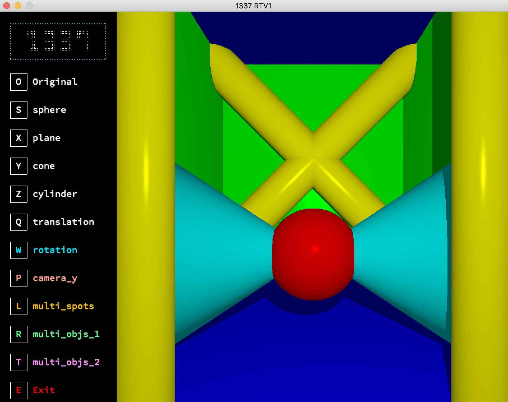
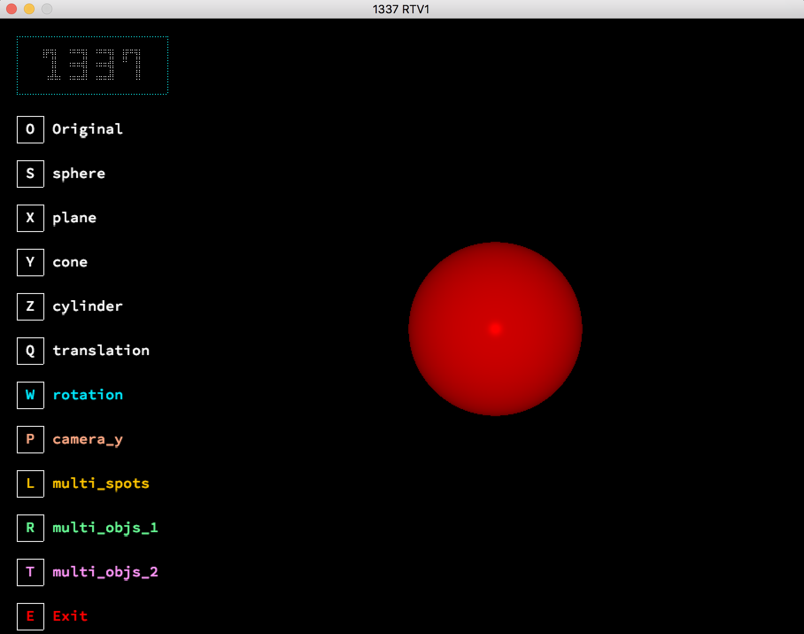
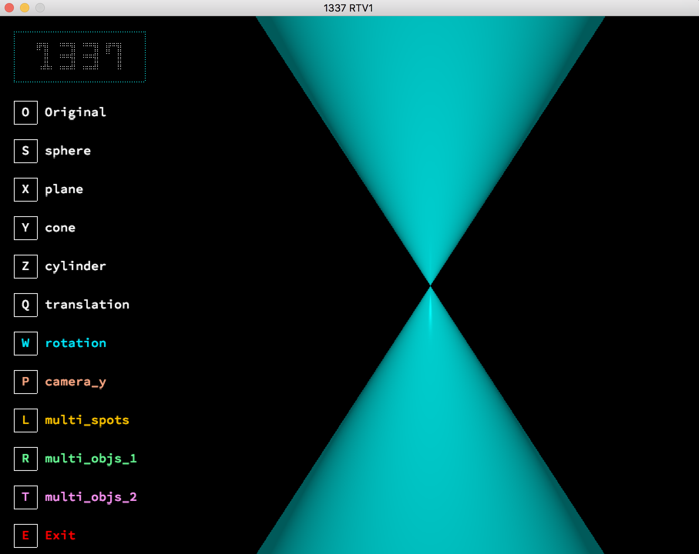
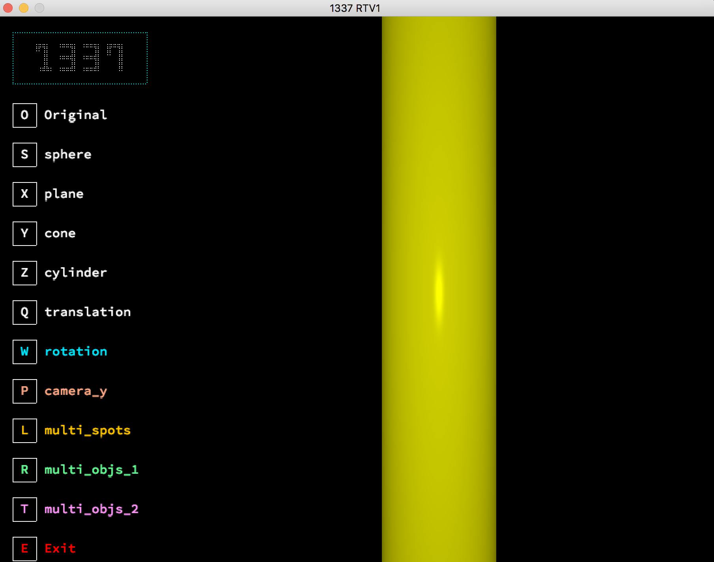
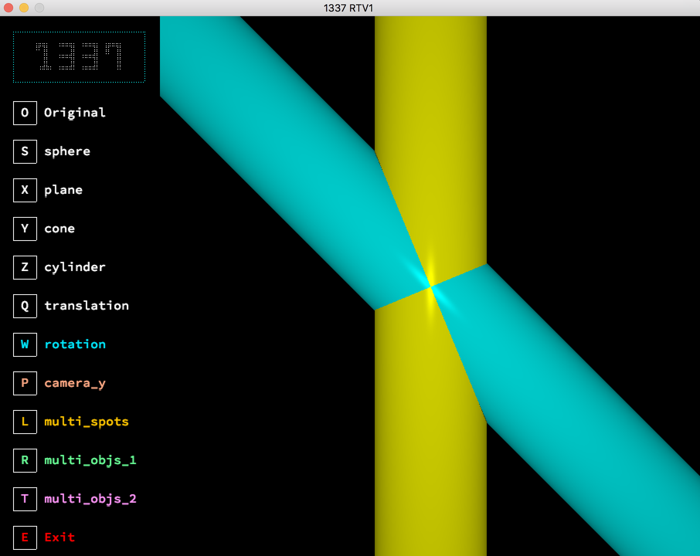
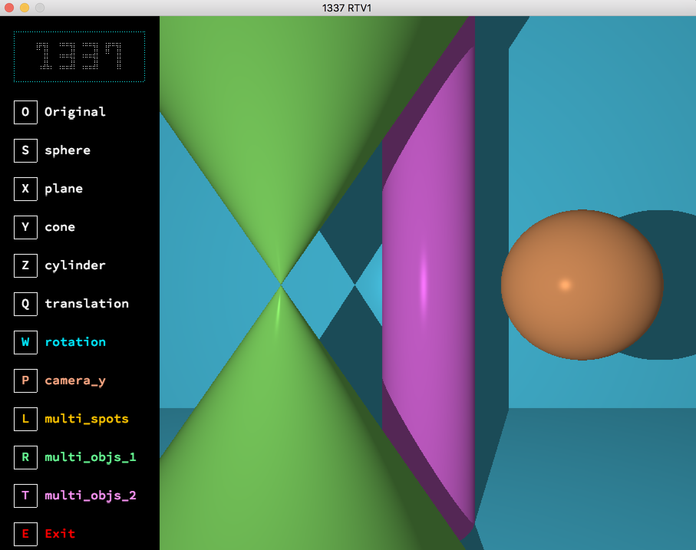

# RT project


[](#contributors-)


<p align="center">
  <a href="https://en.wikipedia.org/wiki/Ray_tracing_(graphics)">
    
  </a>
</p>
<h1 align="center">
  Ray Tracing Using C
</h1>
## About
**RT** is a project i made it during my student years at 1337 School khouribga (one of 42 Network), This project is the first step to create a Raytracing program, for you to finally be able to render computer-generated images.

## Project Contents :

- [x] 01. Libft : C library regrouping usual functions that we’ll be allowed to use in all your other projects.
- [x] 02. minilibx
- [x] 03. Ray Tracing files + Parsing folder
- [x] 04. scenes
- [x] 05. xpm files (for loading + textures)

# Features!

  - multi objects 
  - Multi spots
  - light : normal + direct + parallel
  - Composed elements : PEN
  - Reflexion 
  - Refraction
  - Transparency
  - Textures
  - Save the draw as bmp image
  - noise : perlin + damier + XOR + wood

## How to use the xml file 

## Parsing file format

```yaml
camera:
	origin: 0,0,100
	target: 0,0,0
	fov: 60

light:
	origin: 20,20,60
	color: 255,255,255
	power: 400

plane:
	origin: 0,-20,-50
	color: 255,0,0
	axis: 0,1,0
	rotation: 0,0,1
	translation: 0,0,0

sphere:
	origin: 5,5,30
	color: 10,50,255
	ray: 12
	axis: 0,1,0
	rotation: 0,0,0
	translation: 0,0,0

cylinder:
	origin:  28,0,30
	color: 255,255,0
	ray: 8
	axis: 0,1,0
	rotation: 0,0,0
	translation: 0,0,0

cone:
	origin: -30,10,30
	color: 0,255,255
	ray: 20
	axis: 0,1,0
	rotation: 0,0,30
	translation: 0,0,0

```


| id | Shape |
| ------ | ------ |
| 1 | sphere |
| 2 | plane |
| 3 | cylinder |
| 4 | cone |
| 5 | pen |
| 6 | parabolic |


## Getting Started

### Compiling

Run the following commands:

* To compile
	- `make`
* To remove objects:
	- `make clean`
* To remove objects and binary file (program):
	- `make fclean`
* To re-compile:
	- `make re`

### Executing

To run the program:

`./rt [scene.xml]`

## Resources :

- **[KhanAcademy - Vectors & Spaces](https://www.khanacademy.org/math/linear-algebra/vectors-and-spaces)**
- **[Ray Tracing in One Weekend - PDF](https://www.realtimerendering.com/raytracing/Ray%20Tracing%20in%20a%20Weekend.pdf)**
- **[Ray Tracing in One Weekend - Website](https://raytracing.github.io/books/RayTracingInOneWeekend.html)**
- **[All about Ray Tracing - YouTube](https://youtu.be/Ahp6LDQnK4Y)**
- **[Images in minilibx](https://github.com/keuhdall/images_example)**
- **[Ray tracing Cone - Maths behind](http://www.illusioncatalyst.com/notes_files/mathematics/line_cone_intersection.php)**
- **[Raytracing shapes on hugi.scene.org](http://hugi.scene.org/online/hugi24/coding%20graphics%20chris%20dragan%20raytracing%20shapes.htm)**
- **[Scratchapixel : Introduction to Ray Tracing: a Simple Method for Creating 3D Images](https://www.scratchapixel.com/lessons/3d-basic-rendering/introduction-to-ray-tracing)**
- **[Geogebra : Draw objects in 3D](https://www.geogebra.org/3d?lang=en)**
- **[Ray Tracing Tutorial - Youtube Playlist](https://www.youtube.com/playlist?list=PLAqGIYgEAxrUO6ODA0pnLkM2UOijerFPv)**
- 
## ScreenShots

<h2 align="center">Multi Objects 1</h2>

<h2 align="center">Sphere</h2>

<h2 align="center">Cone</h2>

<h2 align="center">Cylinder</h2>

<h2 align="center">Cylinder Rotation</h2>

<h2 align="center">Multi Objects 2</h2>


License
----

MIT


